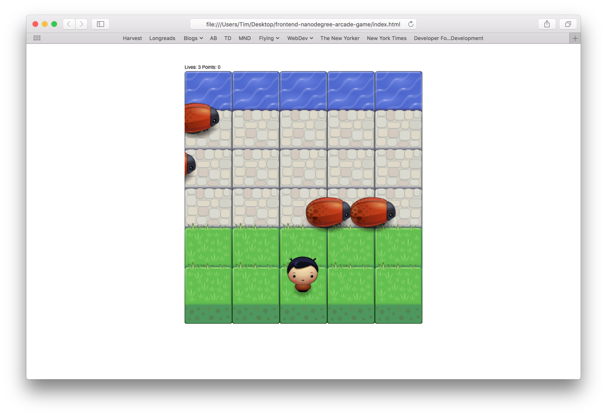

frontend-nanodegree-arcade-game
===============================

# Getting Started

This game is designed to run in a modern web browser. To get started, open `index.html` in your web browser, either by double-clicking the `index.html` file, or by choosing _Open File..._ from your browser's menu.

The game will load and begin automatically; you should be presented with the following screen.

Note, though, that the game requires Javascript to be enabled, and makes use of the HTML `canvas` feature – if you see a blank screen, make sure that Javascript is enabled, and that your browser [supports](http://caniuse.com/#feat=canvas) the `canvas` element.

# Gameplay

The aim of the game is for your player to reach the river on the top row of the board. Be careful not to touch the bugs, though – being intercepted by one of those critters sends you back to the starting square, and you'll lose one of your three lives.

To move the player, use the arrow keys. You can move in any direction, though you'll be confined to the bounds of the game board.

Note that the game will progress in difficulty until your player runs out of lives – expect the bugs to multiply and hasten as the game progresses.